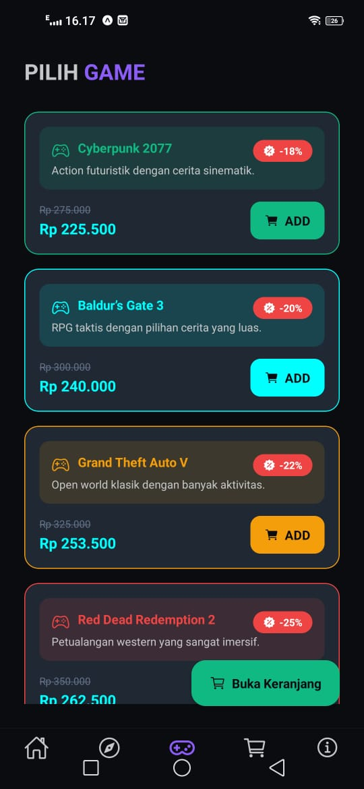
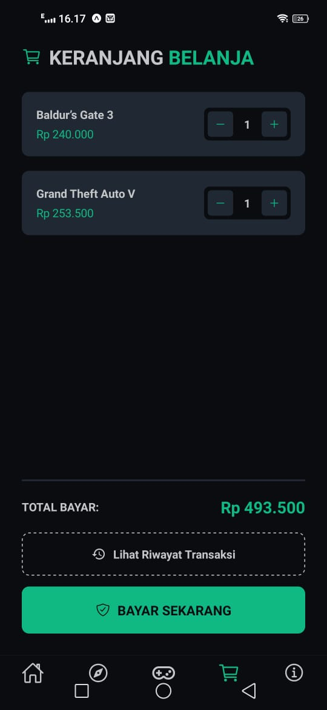

# BamsStore

**BamsStore** adalah aplikasi toko game berbasis mobile yang memudahkan pengguna untuk *browse game*, menambahkannya ke *cart*, melakukan *checkout*, serta melihat *riwayat transaksi*.

## Deskripsi Singkat
Aplikasi ini menyediakan navigasi tab untuk halaman utama (Home, Explore, Games/Menu, Cart, About). Pengguna juga bisa melakukan registrasi/login dan mengelola status akun. Alur transaksi dibuat sederhana: pilih game → tambah ke keranjang → checkout → tampilkan halaman sukses pembayaran.

## Tech Stack
- **Expo** (React Native)
- **React Native**
- **expo-router** (file-based routing)
- **TypeScript**
- UI/Components:
  - `@expo/vector-icons`
- State & data (lokal/in-memory):
  - `AsyncStorage` (tersedia di dependencies)

## Installation Guide
Berikut langkah untuk menjalankan proyek di komputer Anda.

### Prasyarat
- Node.js dan npm terpasang
- Pastikan Anda memiliki perangkat target (mis. Android emulator / iOS simulator) atau gunakan **Expo Go**.

### 1) Install dependencies
Jalankan perintah berikut di folder proyek:

```bash
npm install
```

### 2) Jalankan aplikasi
```bash
npx expo start
```

Setelah command berjalan, gunakan output dari terminal untuk membuka aplikasi, misalnya:
- Buka dengan **Expo Go** (pindai QR code)
- atau jalankan emulator: **Android Studio emulator** / **iOS simulator** (sesuai opsi yang tampil)

### 3) Menjalankan untuk platform tertentu (opsional)
Project sudah menyediakan script berikut di `package.json`:

```bash
npm run android
npm run ios
npm run web
```

## Alur Singkat Penggunaan
1. **Register/Login** (jika belum punya akun)
2. **Browse game** di tab **Games/Menu** atau **Explore**
3. **Tambah ke Cart**
4. **Checkout** dari tab **Cart**
5. Lihat hasil di **Payment Success** dan/atau **History**

## Gambaran Aplikasi

.jpeg)

.jpeg)


